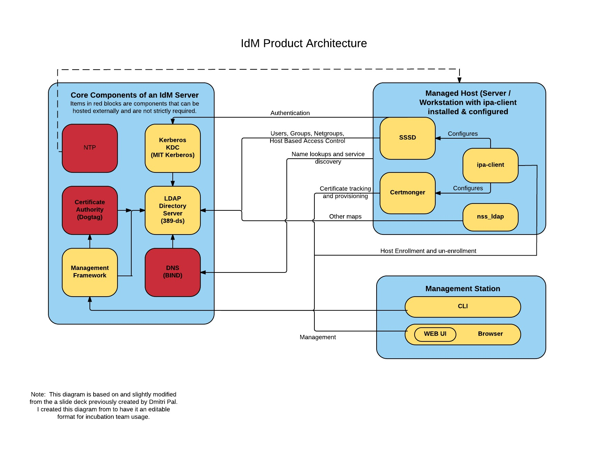

= Intro to Red Hat Identity Management

== About the Red Hat Consulting IdM Field Guide

*What it is:* This guide is a collaborative effort between individuals within Red Hat Consulting and Engineering resources to
seed basic knowledge of Identity Management throughout the consulting organization.  As IdM's feature set expands, we are seeeing
more and more interest from customers in deploying IdM as a method of providing centralized access to RHEL hosts in
their environment.  Scoping & designing an IdM environment is not exactly common knowledge - we want to help expand the field of consultants and
and architects who are able to do so.  In addition, this guide will also act as a field manual for installation, configuration, integration, and basic
troubleshooting that a consultant may encounter during an IdM deployment.

*What it is not:* This document is not intended to be an authoritative technical reference for IdM, or any of its components, or replace any official form of documentation or training.
As this is geared toward consultants, it is not intended to be shared with customers at this itme.

== What Do I Need To Know To Deploy IdM?

IdM consists of several upstream projects:

* http://www.ntp.org/[NTP]
* http://web.mit.edu/kerberos/[MIT Kerberos]
* http://pki.fedoraproject.org/wiki/PKI_Main_Page[Dogtag (Certificate Authority)]
* http://directory.fedoraproject.org/[389-ds (LDAP Directory Server)]
* https://www.isc.org/downloads/bind/[bind (DNS)]
* https://fedorahosted.org/sssd/[SSSD]

You should have at least a basic understanding of what each of those components do and how they inter-operate to deliver a basic IdM engagement.  For example, you don't necessarily need to be PKI expert, but you should understand the implications of using a self-signed cert in IdM versus having a certificate signed by an external (presumably trusted) CA. And you shoud understand what a CA is.

Below is a diagram of the IdM components, and how they work together at a high level. 

